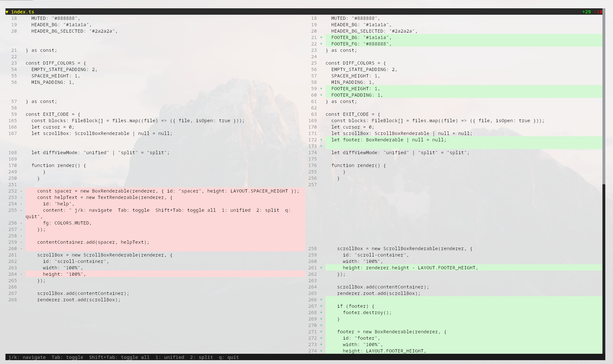

# diffacto



A beautiful terminal UI application for viewing git diffs with an interactive, collapsible interface.

## Features

- **Auto-refresh**: Automatically updates when files change in your repository with smart debouncing to prevent flickering
- **Split and Unified Views**: Switch between side-by-side split view and unified diff view
- **Collapsible File Blocks**: Expand/collapse individual files or toggle all at once
- **Keyboard Navigation**: Vim-style j/k navigation with intuitive shortcuts
- **Smart Color Coding**: Light/dark theme compatible colors with clear visual indicators
- **Scrollable Interface**: Navigate through large diffs with ease
- **Status Overview**: See file status (added/modified/deleted/renamed) and change statistics at a glance
- **Staged and Unstaged Changes**: Shows both staged and unstaged changes merged by filename
- **Rename Detection**: Automatically detects renamed files with similarity threshold

## Installation

```bash
bun install
```

## Usage

Run diffacto in any git repository:

```
$ ./diffacto --help
diffacto - A beautiful terminal UI for viewing git diffs

Usage: diffacto [options]

Options:
  -h, --help        Show this help message
  -s, --split       Start in split view mode (default: unified)
  -u, --unified     Start in unified view mode (default)
  -f, --follow      Enable follow mode - auto-scroll to changes (default)
  -F, --no-follow   Disable follow mode
  -c, --collapsed   Start with all file blocks collapsed
  -e, --expanded    Start with all file blocks expanded (default)

Keyboard Shortcuts:
  j/k, ↑/↓          Navigate between files
  Tab               Toggle current file block
  Shift+Tab         Toggle all file blocks
  1                 Switch to unified view
  2                 Switch to split view
  f                 Toggle follow mode
  q                 Quit
```

## Technical Details

Built with:
- **Runtime**: [Bun](https://bun.com) - Fast all-in-one JavaScript runtime
- **UI Framework**: [OpenTUI](https://github.com/opentui/opentui) - Terminal UI framework using native Zig core
- **Language**: TypeScript

Single-file architecture (`diffacto`) with no build step required - Bun runs TypeScript directly.
